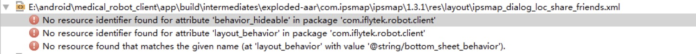
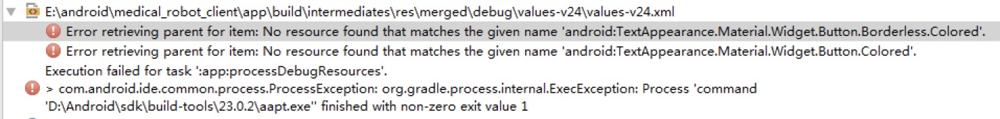
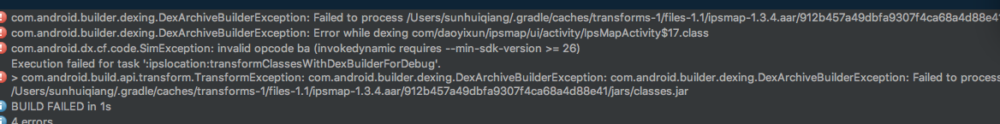

XunjiMapSDK-Android 是一套基于 Android 4.3 及以上版本的室内地图应用程序开发接口，供开发者在自己的Android应用中加入室内地图相关的功能，包括：地图显示（多楼层、多栋楼）、室内导航、模拟导航、语音播报等功能。


## 添加依赖

```


建议使用marven 方式
// marven
   compile 'com.locnavi:map:0.1.4'


// 或去除重复的依赖
compile ('com.locnavi:map:0.1.4', {
      exclude group: 'com.android.support'
  })

```


## 目前支持的cpu 架构 arm,暂时不支持其他架构,请配置下面的cpu架构 ,去除其他类型的 CPU 类型,可以参考 app.gradle
```
在app.gradle 中配置如下 ,去除其他 CPU 类型

armeabi {
    versionCode defaultConfig.versionCode*10 + 1
    ndk {
        abiFilters = ["armeabi"]
    }
}

```


## 加入权限 如果编译的版本大于和等于 Android6.0,请使用动态权限申请 
```
在 manifest 中进行配置
<uses-permission android:name="android.permission.BLUETOOTH" />
<uses-permission android:name="android.permission.READ_PHONE_STATE" />
<uses-permission android:name="android.permission.INTERNET" />
<uses-permission android:name="android.permission.ACCESS_NETWORK_STATE" />
<uses-permission android:name="android.permission.CHANGE_WIFI_STATE" />
<uses-permission android:name="android.permission.WRITE_EXTERNAL_STORAGE" />
<uses-permission android:name="android.permission.WRITE_SETTINGS" />
<uses-permission android:name="android.permission.ACCESS_FINE_LOCATION"/>

```

## 使用
初始化

在Application 的onCreate 方法中进行初始化(特别注意,如果使用多进程比如推送服务,Application 的 onCreate 会被多次初始化,请初始化一次 SDK),在manifest 中进行声明 新的 Application

``` 
XJMapSDK.init(context,appKey);
或定制配置信息 ,使用微信分享功能请实现相关的接口
XJMapSDK.init(new XJMapSDK.XJMapConfiguration.Builder(context)
    .appKey(Constants.IPSMAP_APP_KEY)
    .shareToWechatListener(this)
     .debug(false)
      //开启debug 后有log 日志,打正式版请务必关闭debug 日志
      // 默认是false , 如果项目正式上线 debug 是false
      //以下情况: debug 只能是 true 如果是开发人员给出的测试 mapid(在正式版道一循上不显示,道一循Beta 版的列表显示)
    .build());

```


如果主工程已经执行 cordova plugin add ./cordova-plugin-ipsmapSDK 下面的配置不用配置,插件会自动生成先关的代码 
```
在 src/xml/config 中添加插件的配置
<feature name="MapPlugin">
    <param name="android-package" value="com.daoyixun.ipsdemocordava.MapPlugin" />
</feature>

```


创建包名com.daoyixun.ipsdemocordava.MapPlugin 下的类 MapPlugin 
```
根据前端传递的参数进行修改 mapid 和 targetId

XJMapSDK.openXJMapActivity(this.cordova.getActivity(), map_id);
XJMapSDK.openXJMapActivity(Context context, String mapId, String targetId);

```

启动地图方式1,携带目的地和地图id,导航到目的地
```


XJMapSDK.openXJMapActivity(Context context, String mapId, String targetId);

```

启动地图方式2,仅仅传递地图的id
```
XJMapSDK.openXJMapActivity(Context context, String mapId);

```


## 混淆

```
-dontwarn com.baidu.**
-keep class com.baidu.** {*;}
-dontwarn com.iflytek.**
-keep class com.iflytek.**{*;}
-keep public class com.sails.engine.patterns.IconPatterns
```


## FAQ
1.0


出现上面的类似xml资源文件缺失的情况:
两种解决方案:
1. 在通过gradle 引用是加入exclude group: 'com.android.support' ,并且自己加入compile 'com.android.support:appcompat-v7:版本号'
建议方式.建议版本号25.3.1
2. 修改项目的support 支持和  compile 'com.android.support:appcompat-v7:25.3.1' 版本号一致

2.0 
```
app如果使用了okhttp ,glide ...出现第三发开源库 冲突
两种解决方案:
1.通过  exclude group: "com.squareup.okhttp3" 方式处理
然后保留项目的okhttp和glide 
2.保持和sdk的一致引入的第三方库版本号一致.否则有可能出现冲突
```
```
"glide"             : "com.github.bumptech.glide:glide:3.7.0",
"okhttp"            : "com.squareup.okhttp3:okhttp:3.8.0",
"gson"              : "com.google.code.gson:gson:2.8.2",
 ```        


 3.0
 

 
 
```


    allprojects {
        repositories {
            jcenter()
            maven { url "https://jitpack.io" }
            flatDir {
                dirs 'libs'
            }
        }
    }
    
    compileOptions {
         sourceCompatibility JavaVersion.VERSION_1_8
         targetCompatibility JavaVersion.VERSION_1_8
     }
```


 4.0


```
        在 Manifest的 application  中加入这个
        <uses-library android:name="org.apache.http.legacy" android:required="false" />

```


